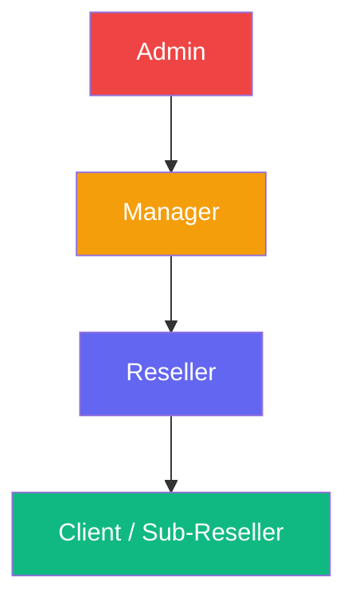
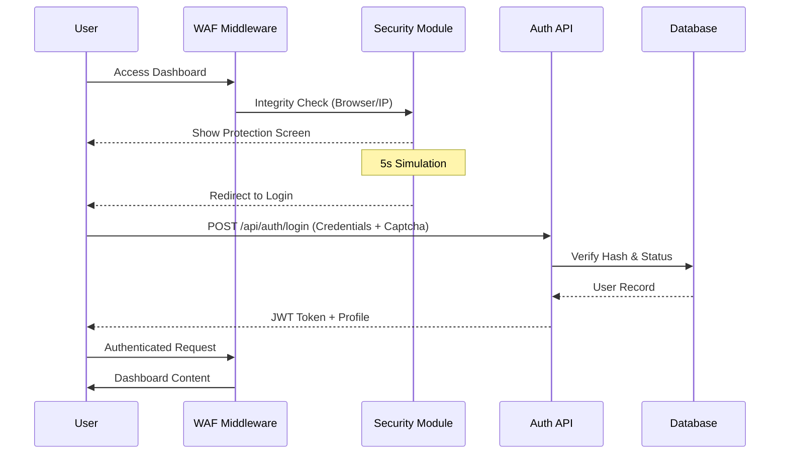
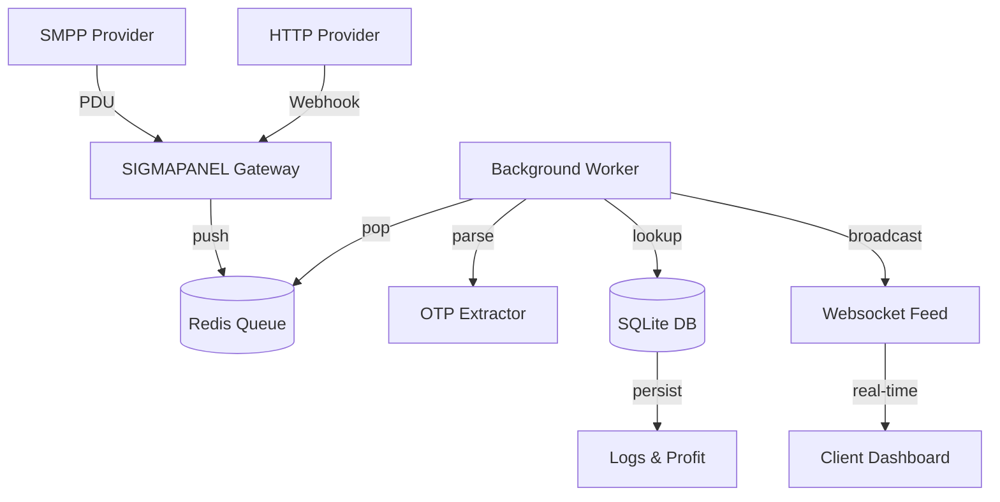

# 🚀 SIGMAPANEL v3 — Professional Telecom & SMS Infrastructure

SIGMAPANEL is an enterprise-grade, high-performance telecom SMS gateway and management dashboard. It transforms complex telecom protocols into a streamlined, modular SaaS experience. Built with a **FastAPI** asynchronous backend and a **Vanilla JS Single Page Application (SPA)** frontend.

---

## 🏛 Hierarchical Architecture & Role System

SIGMAPANEL uses a strict hierarchical model for data isolation and resource management:



| Role | Responsibilities |
| :--- | :--- |
| **Admin** | Full system control, provider management, global security settings, and audit logs. |
| **Manager** | Oversees resellers, approves registration/payout requests, and monitors traffic. |
| **Reseller** | Manages their own inventory of numbers and creates **Client** (Sub-Reseller) accounts. |
| **Client** | The end-user level. Accesses assigned numbers, views OTPs, and integrates via API. |

---

## ⚡ System Flows

### 1. Authentication & Security
Every request is protected by JWT and a specialized WAF middleware.



### 2. SMS Processing (SMPP/HTTP)
High-throughput processing via Redis-backed asynchronous queues.



---

## 📂 Detailed File Structure

### 🌍 Root Directory
- `main.py`: **Application Kernel.** Initializes FastAPI, mounts static files, configures middleware, and aggregates all modular routes.
- `smpp_server.py`: **SMPP Gateway.** A full-featured asynchronous SMPP server listening on port 2775. Handles `BIND_TRANSCEIVER`, `SUBMIT_SM`, and `DELIVER_SM` for external provider interconnections.
- `worker.py`: **Task Consumer.** A dedicated process that listens to the Redis queue, performs number matching, extracts OTPs, and calculates profit margins.
- `database.py`: **Persistence Layer.** Manages SQLite WAL-mode connections, table definitions, and automatic schema migrations.
- `queue_manager.py`: **Messaging Broker.** Implements Redis connection pooling and reliable queuing logic for cross-process communication.
- `security_middleware.py`: **Web Application Firewall (WAF).** Intercepts every HTTP request for IP blacklisting, rate-limiting, CSP injection, and browser integrity validation.
- `otp_extractor.py`: **NLP Engine.** Uses optimized regular expressions to identify and extract verification codes from global SMS formats.
- `phone_utils.py`: **Telecom Utilities.** Handles international number normalization (E.164) and prefix-based routing logic.
- `sms_processor.py`: **Business Logic.** The core engine that matches incoming messages to specific user allocations and applies pricing rules.
- `country_detector.py`: **Geographic Engine.** Provides offline mapping of phone prefixes to ISO-3166 country codes and names.
- `service_detector.py`: **Brand Identifier.** Maps sender IDs and message patterns to known services like WhatsApp, Google, Binance, etc.
- `auth.py`: **Security Core.** Implements bcrypt password hashing and JWT-like token generation/verification.
- `Dockerfile` & `docker-compose.yml`: **Orchestration.** Production-ready containerization for the entire stack (App, Worker, SMPP, Redis).
- `entrypoint.sh`: **Process Manager.** Unified startup script that launches the API, Worker, and SMPP server simultaneously within Docker.
- `nginx_hardened.conf`: **Reverse Proxy.** A secure Nginx configuration with optimized SSL/TLS and buffer settings.
- `requirements.txt`: **Dependencies.** Lists all Python libraries needed (FastAPI, Redis, Bcrypt, etc.).
- `sigmapanel.service`: **Systemd Config.** Template for running SIGMAPANEL as a background service on Linux VPS.

### 📍 Modular API Routes (`/routes`)
- `auth.py`: Handles JWT auth, signups (with toggle/limits), and "Me" profile lookups.
- `users.py`: Hierarchical management (Admin > Manager > Reseller > Client).
- `numbers.py` & `numbers_ext.py`: Inventory tracking, bulk allocation, and global number revocation tools.
- `sms.py`: SMS logs, profit/loss metrics, and real-time delivery reporting.
- `ranges.py`: Management of number ranges, inventory counts, and pricing rule engines.
- `providers.py`: Configuration of external SMPP/HTTP SMS providers.
- `transactions.py`: Financial ledger for balance adjustments and payment request tracking.
- `notifications.py`: Role-based system alerts, broadcasts, and news.
- `settings.py`: Global system configuration (Signup status, contact details, webhook specs).
- `webhook.py`: High-performance endpoint for receiving incoming SMS via HTTP from 3rd party vendors.
- `dashboard.py`: Statistics aggregator for the overview charts and summaries.

### 🎨 Frontend Assets (`/static`)
- `index.html`: **SPA Shell.** The single entry point for the frontend; loads CSS and JS modules.
- `css/style.css`: **The Big Theme.** A custom, highly-responsive Indigo/Slate enterprise design.
- `js/app.js`: **Kernel.** Handles navigation, role-based sidebar generation, and app-wide initialization.
- `js/router.js`: **SPA Router.** Manages browser history and dynamic content resolution without page reloads.
- `js/api.js`: **API Client.** Centralized fetch wrapper with automatic token management and error handling.
- `js/ui.js`: **Component Library.** Reusable UI elements, icons (SVG), and toast notifications.
- `js/security.js`: **Defense UI.** Renders the browser integrity check and the security dashboard.
- `js/dashboard.js`: **Analytics Page.** Implements Chart.js visualizations for traffic and profit.
- `js/sms.js`: **SMS Module.** Filtering, searching, and live OTP feed implementation.
- `js/numbers.js`: **Inventory Module.** Tables for number management, bulk tools, and exports.
- `js/users.js`: **Management Module.** User creation forms and hierarchy visualization.
- `js/ranges.js`: **Carrier Module.** Range pricing and inventory control.
- `js/payments.js`: **Finance Module.** Payout and registration request queues.
- `js/smpp.js`: **Gateway Module.** Real-time monitoring of SMPP Server sessions and accounts.
- `js/settings.js`: **Preference Module.** Platform configuration and signup controls.
- `js/test_panel.js`: **Demo Module.** Specialized tools for the `test123` account.

---

## 🚀 Deployment Guide

### 1. VPS / Dedicated (Ubuntu 22.04+)
Recommended for production due to port 2775 (SMPP) requirements.

**Automated Setup (Docker):**
```bash
git clone https://github.com/AdnanTermux/SIGMAPANEL.git
cd SIGMAPANEL
docker-compose up -d --build
```

**Manual Setup:**
1. Install Python 3.12+, Redis, and Nginx.
2. `pip install -r requirements.txt`
3. Use the provided `sigmapanel.service` for systemd management.
4. Configure `nginx_hardened.conf` for reverse proxy and SSL.

### 2. Cloud Platforms (Railway / Render)
1. Link your repository to the platform.
2. Add a **Redis** instance.
3. Define Env Vars:
    -   `DATABASE_URL`: `/data/sigmapanel.db`
    -   `REDIS_URL`: `redis://your-redis-url`
4. Deploy. The platform will use the `Dockerfile` automatically.

---

## 🔌 Connection Specifications

### 📡 Built-in SMPP Server
-   **Port:** `2775`
-   **System ID:** Your Account Username
-   **Password:** Your Account Password
-   **Supported Bind:** `bind_transceiver`, `bind_receiver`, `bind_transmitter`
-   **DLR Format:** `id:(.*?) sub:.*? dlvrd:(.*?) stat:(.*?) err:(.*?)`

### 🔗 HTTP Incoming Webhook
-   **Endpoint:** `https://your-domain.com/api/webhook/receive`
-   **Params (GET/POST):**
    -   `to`: Recipient Number
    -   `from`: Sender ID
    -   `msg`: Message Content
    -   `secret_token`: Your API Token (Security Tab)

---

## 🧪 Demo Account
Explore the restricted test panel without registration:
-   **Username:** `test123`
-   **Password:** `test123`

## 🛠 Advanced Features

### Test Panel (Telecom Mode)
A dedicated dashboard for testing infrastructure access.
- **Dynamic Rotation:** Automatically displays 10 random active numbers per range.
- **App Access Check:** Send an OTP to any displayed number and watch it arrive in real-time.
- **Reporting:** Export test reports to CSV, Excel, or PDF.

### SMPP Server Interconnect
SIGMAPANEL acts as a full SMPP Server (v3.4).
- **Multiple Providers:** Supports concurrent transceiver binds.
- **Throughput Control:** Per-account TPS limiting.
- **Encoding Support:** Full GSM7 and UCS2 (Unicode) support for global OTP delivery.

### Bulk Resource Management
- **Smart Allocation:** Assign hundreds of numbers to resellers in a single click.
- **Global Revocation:** One-click "Kill Switch" to unassign all numbers in case of emergency.
- **Application Blacklist:** Block specific apps (e.g., Telegram, WhatsApp) globally or per-range to control traffic quality.

---

Developed with ❤️ for the Global Telecom Community.
